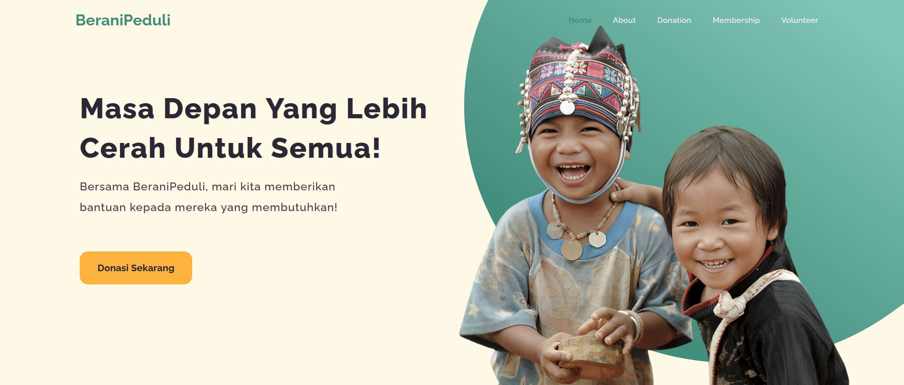

# BeraniPeduli 🤝

Welcome to **BeraniPeduli**, a web-based platform designed to make fundraising and donations easy and impactful. Our platform connects donors with those in need, empowering individuals, groups, or organizations to contribute to various social and humanitarian causes. Together, we can create meaningful change.

<br>

## 🚀 Live Demo

Experience the live platform: [https://beranipeduli.vercel.app](https://beranipeduli.vercel.app)

## 🛠️ Features

- **Effortless Donations**: Simplify the process of donating to campaigns.  
- **Transparency**: See how donations are utilized to make an impact.  
- **Campaign Showcase**: Highlight and explore various social and humanitarian campaigns.  
- **Responsive Design**: Accessible on any device, ensuring a seamless experience.  

## 💻 Technologies Used

- **Frontend**: React.js (TypeScript), CSS
- **Tooling**: Vite, ESLint
- **Hosting**: Vercel  

## 📸 Screenshots

  

## 🔧 Installation

If you want to run this project locally, follow these steps:

1. Clone the repository:
   ```bash
   git clone https://github.com/Kezota/BeraniPeduli.git
   ```
2. Navigate to the project directory:
   ```bash
   cd BeraniPeduli
   ```
3. Install the dependencies:
   ```bash
   npm install
   ```
4. Start the development server:
   ```bash
   npm run dev
   ```
5. Open `http://localhost:5173` in your browser to view the app.

## 👏 Credits

This landing page was crafted with care by [Kezota](https://github.com/kezota)

## 🤝 Contributing

If you'd like to contribute to the development of this project, feel free to fork the repository and submit a pull request. Contributions are always welcome!

